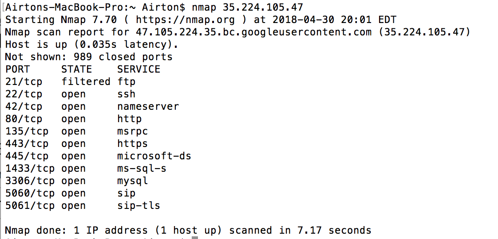

# Week9Honeypot

Which Honeypot(s) you deployed  
* Honeypot1 - Dionaea over HTTP

Any issues you encountered  
* gcloud ssh started experiencing some problems and wouldn't let me ssh in 

A summary of the data collected: number of attacks, number of malware samples, etc.  

Attacked ports (Dionaea):
* 5060 (600 times)
* 22 (302 times)
* 3306 (143 times)
* 443 (100 times)
* 80 (60 times)
*5060 (42 times)

Any unresolved questions raised by the data collected
*None

